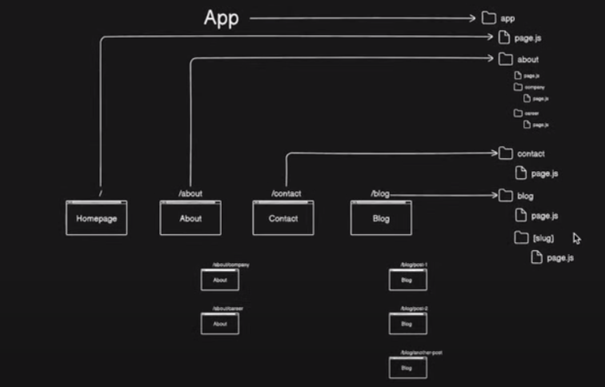
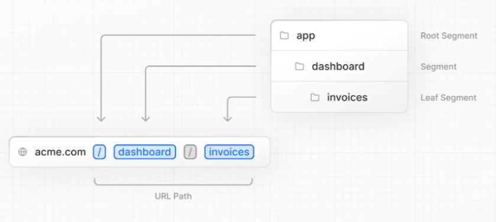
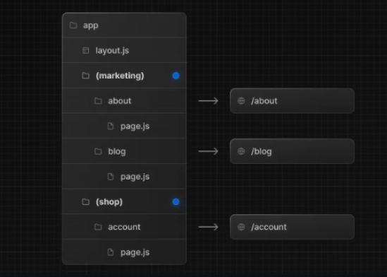
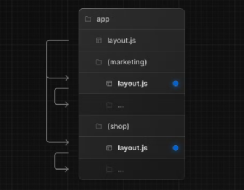

# Routes

A route refers to a specific URL path within your application. Routes determine what content or component is rendered when a user visits a particular URL. Next.js provides a built-in routing system that allows developers to define routes and associate them with React components using file-based routing or dynamic routing mechanisms. This makes it easier to create single-page applications (SPAs) with multiple views or pages while keeping the code organized and maintainable.

## Nested Routes

Next.js uses file-system routing where folders are used to create nested routes. Each folder represents a route segment that maps to a URL segment.

# Dynamic Routes

- When you don't know the exact segment names ahead of time and want to create routes from dynamic data, you can use Dynamic Segments that are filled in at request time or prerendered at build time.

- Dynamic routing in Next.js allows you to create pages whose URLs have parts that change based on data, like product IDs, blog post slugs, or user profiles. This is useful for building applications with many unique pages.

A Dynamic Segment can be created by wrapping a folder's name in square brackets: [folderName]. For example, [id] or [slug].
Dynamic Segments are passed as the `params` prop to layout, page, route, and generateMetadata functions.

# Route Groups

In the app directory, nested folders are normally mapped to URL paths. However, you can mark a folder as a Route Group to prevent the folder from being included in the route's URL path.

This allows you to organize your route segments and project files into logical groups without affecting the URL path structure.

## Convention

A route group can be created by wrapping a folder's name in parenthesis: (folderName)

# Organize routes without affecting the URL path

To organize routes without affecting the URL, create a group to keep related routes together. The folders in parenthesis will be omitted from the URL (e.g. (marketing) or (shop)).

Even though routes inside (marketing) and (shop) share the same URL hierarchy, you can create a different layout for each group by adding a layout.js file inside their folders.

