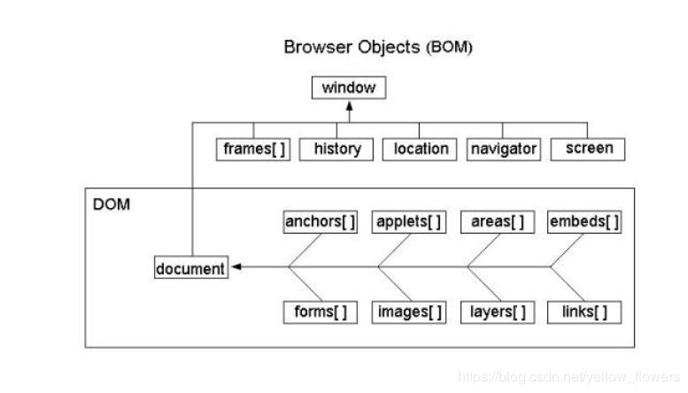
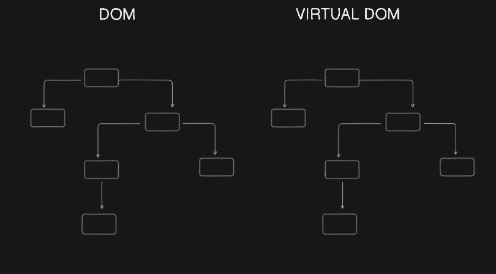

# BROWSER OBJECT MODEL (DOM):

BOM stands for Browser Object Model. It's a programming interface provided by web browsers that allows JavaScript to interact with the browser itself, including its windows, frames, and others. The BOM provides browser-related objects, methods, and properties to manipulate browser functionality, such as controlling the browser's history, managing cookies, and interacting with the user's operating system. Unlike the DOM, which deals with the structure of web documents, the BOM deals with the browser's environment itself.

# DOCUMENT OBJEXT MODEL (DOM):

DOM stands for Document Object Model. It's a programming interface for web documents that represent the structure of HTML & XML document as a tree-like model. This model allows JavaScript to interact with the elements of a web page such as changing their style, content or structure dynamically. Essentially, the DOM provides a way for scripts to access and manipulate the content of a web page after it has been loaded into the browser.

# REACT VIRTUAL DOM:

The virtual dom is a lightweight copy & real dom modified by react when you make changes to a React Component. React first updates the virtual dom rather than the actual browser dom.

## How Does It Work?

- **Render:** when a React Component's state or props change. React re-renders the Component & generates a new virtual dom.

- **Diffing:** Then React compares the new Virtual DOM tree with the previous one to identify the difference (or 'diff') between them. It determines what part of the actual DOM needs to be updated.

<!-- If any change occurs in Virtual DOM node, React cannot modify the original DOM. Instead, React creates a copy of the Virtual DOM and make changes to this copy first. After changing this Virtual DOM, React compares this with the previous version to identify which components have been changed. Once this comparison is done, React updates only the specific components that have changed in the original DOM. -->

- **Reconciliation:**
1. The algorithm React uses to diff one tree with another to determine which  
 parts need to be changed.
2. React calculates the most efficient way to update the actual DOM based on the identified differences. Instead of directly manipulating individual DOM elements, React generates a minimal set of DOM operations to bring the real DOM in sync with the Virtual DOM.

- **Updating the DOM:** Finally, React applies these changes to the real DOM, updating only the necessary parts without rerendering the entire page.

[Fiber](https://github.com/acdlite/react-fiber-architecture)

[Video Link](https://www.youtube.com/watch?v=MPCVGFvgVEQ&t=1107s)
