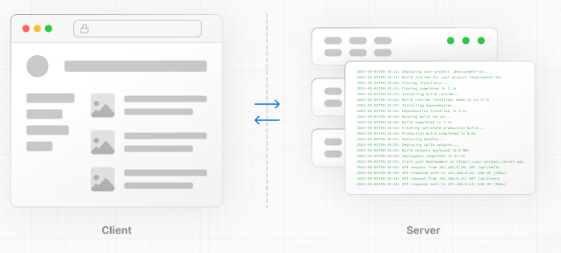
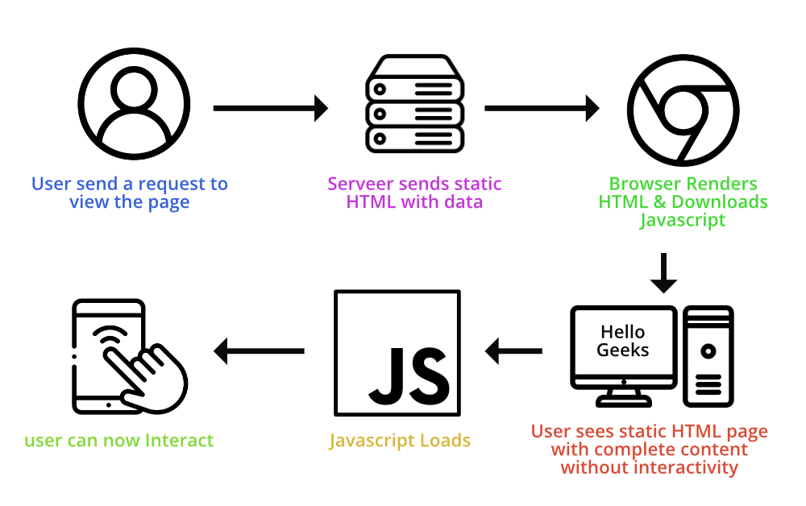

# Rendering

Rendering is the process that transforms the code you write into user interface

React & Next.js allow you to create hybrid web app where part of your code an be rendered on the client or server side

## Rendering Environments

There are two rendering Environments

- Clients
- Server

### Client

The Client refers to the browser on a user's adevice that send a request to a server for your application code.

### Server

The server refers to a computer in a data center that store your application code.

---

# Request Responce LifeCycle

1. **User sends a request to view the page**: A user initiates a request to view a web page by typing the URL into their browser or clicking a link.

2. **Server sends static HTML with data**: The server receives the request and responds by sending back a static HTML file along with any necessary data. This HTML file contains the basic structure of the web page and may include placeholders for dynamic content.

3. **Browser Renders HTML & Downloads JavaScript**: The browser receives the HTML file from the server and starts rendering the content. As it parses the HTML, it may encounter references to external JavaScript files. It downloads these JavaScript files in the background.

4. **JavaScript Loads**: Once the HTML content is rendered, the browser begins loading and executing the JavaScript files it downloaded earlier. This JavaScript code adds interactivity to the page, such as handling user interactions, fetching additional data, or modifying the DOM.

5. **User can now interact**: With the JavaScript loaded and executed, the web page becomes fully interactive. Users can now click buttons, fill out forms, or perform other actions on the page.

6. **User sees static HTML page with complete content without interactivity**: Initially, the user sees the static HTML content rendered by the browser, which includes the basic structure and initial data of the web page. The page may lack interactivity until the JavaScript finishes loading and executing. Once the JavaScript is loaded and executed, the page becomes interactive, providing a richer user experience.

# Client Side Rendering (CSR):

Client side rendering refers to the process where our application is rendered on client side, meaning that the data is delevered from the server to client side in to HTML, then the page is show to the user.

This image illustrates the process of loading a website in a browser:

1. **User requests a browser**: A user initiates a request to open a web browser.

2. **Browser requests a server**: The browser sends a request to the server to retrieve the content of a particular web page.

3. **Server sending an HTML file with JS**: The server responds to the browser's request by sending back an HTML file along with JavaScript (JS) code. This HTML file contains the basic structure of the web page, while the JavaScript adds interactivity and functionality to the page.

4. **Browser downloads HTML file (loading 10%)**: The browser begins downloading the HTML file sent by the server. The loading progress is indicated as 10%.

5. **Browser downloads CSS & JS (loading 50%)**: While the HTML file is being downloaded, the browser also starts downloading any CSS and JavaScript files referenced in the HTML. These files are necessary for styling the web page and adding interactivity. The loading progress for CSS and JS files is indicated as 50%.

6. **Browser loads whole website (loading 100%)**: Once all the necessary files (HTML, CSS, and JS) are downloaded, the browser starts rendering the entire website. As the rendering process progresses, the loading progress reaches 100%, indicating that the website is fully loaded and ready for interaction.

### DisAdvantages of CSR:

- When JavaScript code is sent from the server, it significantly impacts SEO because HTML tags and content play a crucial role in improving SEO.
- When new data is added, our JavaScript file and bundle will grow, which can slow down our website speed.
- Security issues such as exposing secret APIs, keys, passwords, and sensitive information are not recommended in client-side rendering (CSR) as it is generally less secure. There are increased chances of hacking due to the visibility of sensitive data in client-side code.

# Server Side Rendering (SSR):

Server-side rendering involves loading data on the server and rendering the entire application in the browser by generating HTML in response to requests made from the browser.

### Advantages of SSR

The benefits of server-side rendering include:

1. **Improved Initial Page Load Time**: Server-side rendering reduces the initial page load time by generating HTML on the server and sending it to the client, allowing users to see content more quickly.

2. **Enhanced SEO**: Server-side rendering improves search engine optimization (SEO) by ensuring that search engine crawlers can easily index the content of web pages, leading to better visibility in search results.

3. **Better Performance on Low-powered Devices**: Since server-side rendering generates HTML on the server, it reduces the amount of processing required on the client-side, resulting in better performance on low-powered devices or slower internet connections.

4. **Support for Social Media Sharing**: With server-side rendering, web pages can be fully rendered on the server before being shared on social media platforms, ensuring that shared links display correctly and contain relevant content.

5. **Progressive Enhancement**: Server-side rendering allows for progressive enhancement by ensuring that the core content of the web page is accessible even if JavaScript is disabled or not supported in the browser.

6. **Easier Debugging and Testing**: Server-side rendering simplifies debugging and testing processes since rendering occurs on the server, making it easier to identify and fix issues related to page rendering and content delivery.

# Hydration
[Hydration](https://www.youtube.com/watch?v=kZG3izJu7qE&list=LL&index=57&t=182s)

# Pre Rendering

Prerendering is when static HTML files for web pages are created in advance, usually during the website building process, instead of generating them dynamically when a user requests a page. These prebuilt HTML files contain the initial content of the web pages and can be sent directly to users.

There are two type of pre-rendering.

- Static side generation (SSG)
- Server side dynamic rendering (SSR)

## Server Side Static Generation (SSG):

Static Site Generation (SSG) is a technique where web pages are generated at build time as static HTML files. These HTML files represent the content of the website and can be served directly to clients. SSG is ideal for websites with content that doesn't change frequently, such as landing pages, blogs, or documentation sites.

### Advantages of SSG:

The Advantages of server-side rendering include:

1. `Fast page load:` HTML page generated at build time, so when a user visits the static page, it can be quickly loaded.

2. `Better SEO:` Static pages include all necessary content, including meta tags, which is good for search engine optimization.

3. `Achieve higher raning`:Helps in achieving higher ranking in search results.

4. `Easy to scale`: SSG website are easy to scale because they don`t required server side data fetching at run time. This make them suitable for website with high traffic.

5. `Improve Security`:SSG wesite are mostly static files, they have lower security risk compare to traditional website.

### DisAdvantages of SSG:

The DisAdvantages of server-side rendering include:

1. `Slow updates:` If a page needs to be updated, it has to be manually rebuilt. Change in dynamic data could result in slow updates.

2. `Not suitable for dynamic data:` Static generation is not suitable for websites with frequently changing data, such as e-commerce websites or real-time dashboards.

## Server side Dynamic Rendering (SSR):

Dynamic rendering is the method of generating HTML pages dynamically on the server side in response to each request. This process occurs when a user makes a request to the server, triggering the generation of the HTML page on the server-side, which is then served to the user. Unlike static rendering, where HTML pages are pre-generated, dynamic rendering involves rendering both client and server components at the time of the request, without caching the result. This approach is beneficial for applications such as news websites, personalized e-commerce pages, and social media feeds, where real-time updates and dynamic content are essential.

### Advantages of Server-Side Dynamic Rendering:

1. `Real-Time Data Integration:` Server-side dynamic rendering allows for the integration of real-time data from databases, APIs, or external sources, ensuring that users receive the most up-to-date information.

2. `Flexible Content Management:` With server-side rendering, content management systems (CMS) can dynamically generate and serve customized content to users based on various criteria, providing flexibility in content presentation.

3. `Improved SEO:` Server-side rendering ensures that search engine crawlers receive fully rendered HTML content, leading to better indexing and improved search engine optimization (SEO) performance compared to client-side rendering.

### Disadvantages of Server-Side Dynamic Rendering:

1. `Performance Overhead:` Server-side dynamic rendering may introduce performance overhead, especially for complex web applications, as it requires processing on the server before delivering fully rendered HTML to the client, potentially leading to slower page load times.

2. `Server Load:` Handling dynamic rendering on the server can increase server load, particularly during peak traffic periods, which may require additional server resources and infrastructure scaling to maintain performance and reliability.

3. `Caching Challenges:` Dynamic content generated on the server may be challenging to cache effectively, as it often varies based on user interactions or other dynamic factors, complicating caching strategies and potentially impacting overall performance optimization efforts.

## Incremental Static Regeneration (ISR)

Incremental Static Regeneration is a feature in Next.js that allows you to update static pages with new data without having to rebuild the entire site. It works by regenerating specific pages when new data is available, rather than regenerating the entire site. This approach improves efficiency and reduces the time it takes to update content, making it ideal for dynamic websites with frequently changing data.

### Advantages Of ISR:

1. `Improved Performance`: ISR allows you to serve static content initially while regenerating it in the background. This means your users get fast page loads while ensuring that your content stays up to date.

2. `Dynamic Content Updates`: With ISR, you can have dynamic content on your static site. The pages are regenerated periodically or upon request, ensuring that your content is always fresh without sacrificing performance.

3. `Reduced Load on Servers`: By serving static content whenever possible and regenerating it incrementally, ISR reduces the load on your servers. This is particularly beneficial for sites with high traffic volumes as it helps maintain performance and scalability.

4. `Better User Experience`: Users get a consistently fast experience, even when content changes frequently. They don't have to wait for pages to rebuild before accessing the latest information, which enhances overall user satisfaction.

5. `SEO Benefits`: Static content is easily crawlable by search engine bots, helping to improve SEO rankings. With ISR, you can have the best of both worlds: dynamic content for users and static content for search engines.

6. `Control Over Regeneration`: Next.js allows you to configure ISR based on your needs. You can specify how frequently pages should be regenerated and whether regeneration should be triggered by user requests or on a schedule.

# COMPONENTS

## Server Components

## Client Components

[Article1](https://medium.com/walmartglobaltech/the-benefits-of-server-side-rendering-over-client-side-rendering-5d07ff2cefe8)

[Article2](https://www.linkedin.com/pulse/avoiding-hydration-errors-nextjs-technical-guide-ali-hamza/)

[Article3](https://medium.com/gitconnected/client-side-rendering-react-vs-server-side-rendering-nextjs-03c4b81c25ab)

[Article4](https://www.linkedin.com/pulse/comparing-nextjs-server-side-rendering-ssr-vs-static-site-pankaj-yyhjc/)
